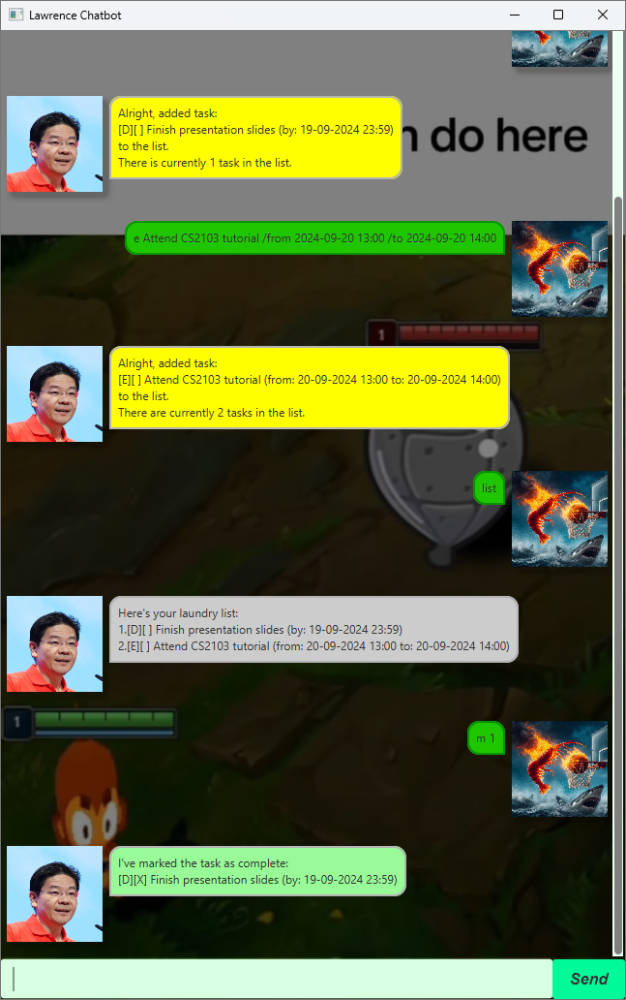

# Lawrence User Guide

Lawrence is a chatbot designed to help you keep track of your tasks.
It offers a myriad of features to ensure that your productivity is unaffected even when faced with high workloads.



This is a list of features that Lawrence offers:
1. Adding of Tasks
2. Updating of Task Completion Statuses
3. Deleting of Tracked Tasks
4. Viewing Tracked Tasks
5. Searching for Tasks using Keywords

# Feature Usage
## Adding Tasks
The bot is able to track 3 types of tasks: Todos, Deadlines and Events.

### Adding Todos
Todos are the simplest of all tasks and are not associated with any time period.

To get Lawrence to track a todo, use the `todo` command.
Usage:
```
todo <todo-name>
```
If successful, the chatbot will respond with a readback of the added Todo.

### Adding Deadlines
Deadlines are similar to Todos, but require an extra date parameter.

To get Lawrence to track a deadline use the `deadline` command.
Usage:
```
deadline <deadline-name> /by <date>
```
If successful, the chatbot will respond with a readback of the added Deadline.

### Adding Events
Events are similar to Deadlines, but require a start date and end date.

To get Lawrence to track an Event, use the `event` command.
Usage:
```
event <event-name> /from <date> /to <date>
```
If successful, the chatbot will respond with a readback of the added Event.

### Successful Add
If the command was executed successfully, the bot should respond with a readback of the added Task.
```
Alright, added <task-details> to the list.
There are currently <total-task-amount> task(s) in the list.
```
### Unsucccessful Add
If there was any error when processing the task to be added, the bot will attempt to diagnose and inform you of the error in the command.

## Updating Completion Statuses
Existing tasks can be marked as complete or incomplete using the `mark` and `unmark` commands respectively.

Usage:
- `mark 1` will mark the first task in the list as complete
- `unmark 2` will mark the second task in the list as incomplete.

If the specified task number does not exist, the bot will not proceed with the request.
Examples of invalid task numbers:
- `mark -1`
- `unmark 6` when there are only `5` tasks in the list.

## Deleting Tasks
Existing tasks can be deleted using the `delete` command with a specified task number.
Usage:
- `delete 1` will delete the first task in the list.

If the specified task number does not exist, the bot will not proceed with the request.
Examples of invalid task numbers:
- `delete -1`
- `delete 6` when there are only `5` tasks in the list.

## Viewing Tasks in the List
The tasks currently tracked by Lawrence can be viewed using the `list` command.
Usage:
```
list
```

## Searching for Tasks
The tasks currently tracked by Lawrence can be searched by their descriptions.
To do so, use the `find` command.

Usage:
```
find <keyword-in-task-description>
```
The bot will consolidate and display the tasks that match the specified keywords.

If no matches are found, the bot will also notify you of the result.

## Exiting the Program
To exit the program, use the `bye` command to terminate the chatbot session.
Usage:
```
bye
```

The tasks added are automatically saved and will persist between chatbot sessions.

# Lenient Syntax
The bot is able to recognise **some** abbreviated commands to reduce the amount of typing the user needs to do.
Commands can be recognised without fully spelling out the command.

Examples include:
- `t` and `to` can be recognised as the `todo` command
- `m` can be recognised as the `mark` command
- `u` can be recognised as the `unmark` command

## Ambiguity
However, it should be noted that the `delete` and `deadline` command can be ambiguous if shortened to a single letter.

As such, the bot will refuse to process commands such as `d` as it may mean two different things.

Luckily, the bot is still able to recognise a slightly longer but still shortened form of these commands:
- `del` is recognised as `delete`
- `deadl` is recognised as `deadline`

# Dealing with Errors
If there was any problem with the execution of a command, the bot will attempt to diagnose it and let you know of any modifications that need to be made to the command.